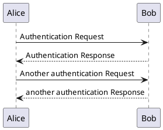

> # [404 - Not found](/)


``` bash
sudo pacman -Syu
```


<!-- tabs:start -->

#### **Hello**

	Hello `World`!

#### **AwesomeFont**

	:fab fa-github fa-fw blue:

#### **Chat**

	<!-- chat:start -->

		#### **Alice**

		Hello Bob!

		#### **Bob**

		Hello Alice!

	<!-- chat:end -->


#### **plantuml**



#### **Panel**

<!-- panels:start -->

<!-- div:title-panel -->

  (...) - Awesome title

<!-- div:left-panel -->

  (...) - Awesome explanation

<!-- div:right-panel -->

  (...) - Awesome example

<!-- panels:end -->


<!-- tabs:end -->

